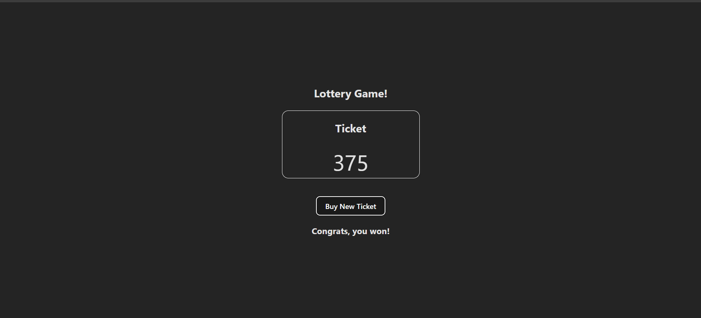

# Lottery Game (ReactJS)

A simple lottery game built with ReactJS.
The game randomly generates 3 numbers, and if their sum equals to 15, you win 🎉

🌐 **Live Demo:** 👉 [Play the Lottery Game on Netlify](https://lottery-game-reactapp.netlify.app/) 🎲

## ✨ Features

- 🎲 Randomly generates 3 numbers every time you buy a ticket
- 🏆 Winning condition: sum of numbers = 15
- 🎉 Displays `"Congrats, you won the lottery!"` if you win
- 😢 Displays "Sorry, you lost!" otherwise
- 🖥️ Built with ReactJS + Vite for fast development

## 📂 Project Structure

```pgsql
lottery-game/
├── public/
├── src/
│   ├── App.jsx
│   ├── Lottery.jsx
│   ├── Ticket.jsx
│   ├── helper.js
│   ├── App.css
│   ├── Lottery.css
│   └── index.css
├── package.json
├── vite.config.js
└── README.md
```

## 🚀 Getting Started

1️⃣ Clone the repo

```bash
git clone https://github.com/your-username/lottery-game.git
cd lottery-game
```

2️⃣ Install dependencies

```bash
npm install
```

3️⃣ Start development server

```bash
npm run dev
```

Now open http://localhost:5173 in your browser.

## 🎮 How to play

1. Open the app in your browser
2. Click “Buy New Ticket”
3. Watch the 3 numbers appear
4. If their sum = 15, you win 🎉,
   Otherwise, better luck next time!

## 🛠️ Built With

- [ReactJS](https://react.dev/) : UI library
- [Vite](https://vite.dev/) : Fast build tool
- [JavaScript(ES6+)](https://developer.mozilla.org/en-US/docs/Web/JavaScript)

## 📸 Demo Screenshot


